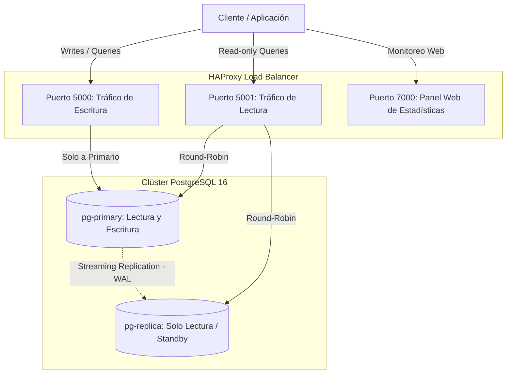

# PostgreSQL High-Availability (HA) Cluster

Clúster de alta disponibilidad y escalabilidad de lectura para **PostgreSQL 16** con replicación por streaming física (*Streaming Replication*) y balanceo de carga mediante **HAProxy**, orquestado con **Podman / Docker Compose**.

---

## 🏗️ Arquitectura del Sistema



### Componentes Clave:
1. **`pg-primary`**:
   - Nodo primario (Read/Write).
   - Crea automáticamente el usuario replicador (`REPLICA_USER`) y autoriza la red en `pg_hba.conf` mediante el script de inicio [`postgres/primary/01-init-replication.sh`](postgres/primary/01-init-replication.sh).
2. **`pg-replica`**:
   - Nodo secundario (Read-Only / Hot Standby).
   - En su primer arranque, el script [`postgres/replica/entrypoint.sh`](postgres/replica/entrypoint.sh) espera al primario y clona la base de datos automáticamente con `pg_basebackup -R`.
3. **`haproxy-lb`**:
   - Balanceador de carga en capa TCP.
   - Separa el tráfico de escritura (nodo primario) del de lectura (repartido entre primario y réplicas mediante Round-Robin).
   - Ofrece un panel web de métricas en tiempo real.
4. **`scripts/maintenance.py`**:
   - Script de Python para verificar el desfase (*replication lag*) y generar copias de seguridad lógicas (`pg_dump`) almacenadas en la carpeta `backups/`.

---

## 🔌 Puertos y Endpoints

| Puerto | Protocolo | Destino / Propósito | Modo |
|---|---|---|---|
| **`5000`** | TCP | `pg-primary:5432` | **Escritura y Lectura** (Directo al nodo maestro) |
| **`5001`** | TCP | `pg-primary:5432` y `pg-replica:5432` | **Solo Lectura** (Balanceo Round-Robin) |
| **`7000`** | HTTP | HAProxy Stats Dashboard | **Panel Web** (`http://localhost:7000`) |

---

## 📁 Estructura del Proyecto

```text
.
├── docker-compose.yml              # Definición de servicios (primary, replica, haproxy)
├── .env.example                    # Plantilla de variables de entorno
├── .gitignore                      # Exclusiones de Git (backups, .env, cachés)
├── README.md                       # Documentación del proyecto
├── haproxy/
│   ├── Dockerfile                  # Imagen basada en haproxy:alpine
│   └── haproxy.cfg                 # Configuración de balanceo y métricas
├── postgres/
│   ├── primary/
│   │   └── 01-init-replication.sh  # Script de inicialización de roles y permisos
│   └── replica/
│       └── entrypoint.sh           # Script de bootstrapping automático (pg_basebackup)
└── scripts/
    ├── maintenance.py              # Monitor de replicación y generador de backups
    └── requirements.txt            # Dependencias de Python (psycopg2-binary)
```

---

## 🚀 Despliegue Rápido

### 1. Requisitos previos
- [Podman](https://podman.io/) y `podman-compose` (o Docker y Docker Compose).
- Python 3.8+ (opcional, para ejecutar los scripts de mantenimiento).

### 2. Configurar variables de entorno
Copia la plantilla `.env.example` a un nuevo archivo `.env`:

```bash
cp .env.example .env
```

Puedes ajustar las contraseñas y nombres de usuario dentro de `.env` si lo deseas:
```dotenv
POSTGRES_DB=app_db
POSTGRES_USER=postgres
POSTGRES_PASSWORD=supersecretpassword
REPLICA_USER=replicator
REPLICA_PASSWORD=replicatorpassword
```

### 3. Levantar el clúster

Con **Podman**:
```bash
podman compose up -d
```

*(O si utilizas **Docker**)*:
```bash
docker compose up -d
```

Comprueba que todos los contenedores estén levantados y saludables (`healthy`):
```bash
podman ps
```

---

## 🧪 Verificación y Pruebas

### 1. Panel de Control de HAProxy
Abre en tu navegador web:
👉 **[http://localhost:7000](http://localhost:7000)**

Podrás observar en verde el estado de salud de `pg_primary` y `pg_replica`.

### 2. Probar inserción (Escritura en puerto 5000)
Conéctate al puerto 5000 para insertar registros en la base de datos:

```bash
psql -h 127.0.0.1 -p 5000 -U postgres -d app_db -c "
CREATE TABLE IF NOT EXISTS test_ha (id SERIAL PRIMARY KEY, note TEXT, created_at TIMESTAMP DEFAULT NOW());
INSERT INTO test_ha (note) VALUES ('Registro replicado con éxito');
"
```

### 3. Probar lectura y balanceo (Puerto 5001)
Consulta a través del puerto balanceado:

```bash
psql -h 127.0.0.1 -p 5001 -U postgres -d app_db -c "SELECT * FROM test_ha;"
```

Comprueba qué nodo responde a la consulta de lectura:
```bash
psql -h 127.0.0.1 -p 5001 -U postgres -d app_db -c "SELECT inet_server_addr(), pg_is_in_recovery();"
```
* Si `pg_is_in_recovery` devuelve `f` (false), la consulta la respondió el **primario**.
* Si devuelve `t` (true), la respondió la **réplica**.

---

## 🛠️ Mantenimiento y Backups

El proyecto incluye una herramienta de mantenimiento en [`scripts/maintenance.py`](scripts/maintenance.py) para monitorizar el retardo de replicación y generar copias de seguridad.

### 1. Instalar dependencias
```bash
pip install -r scripts/requirements.txt
```

### 2. Ejecutar script de mantenimiento
```bash
python scripts/maintenance.py
```

El script realizará:
1. **Verificación de replicación:** Consulta `pg_stat_replication` mostrando la IP del nodo esclavo, el estado de streaming y el desfase de bytes (*lag bytes*).
2. **Generación de Backup:** Ejecuta un volcado lógico con `pg_dump` y lo almacena de forma ordenada en la carpeta dedicada:
   ```text
   backups/backup_app_db_YYYYMMDD_HHMMSS.sql
   ```
   *(Esta carpeta `backups/` se crea automáticamente y está ignorada en `.gitignore`).*

---

## 🛑 Detener y Limpiar el Clúster

Para detener los servicios y eliminar los contenedores:
```bash
podman compose down
```

Para realizar un **reinicio completo desde cero** (eliminando también los volúmenes de datos persistentes):
```bash
podman compose down -v
```
