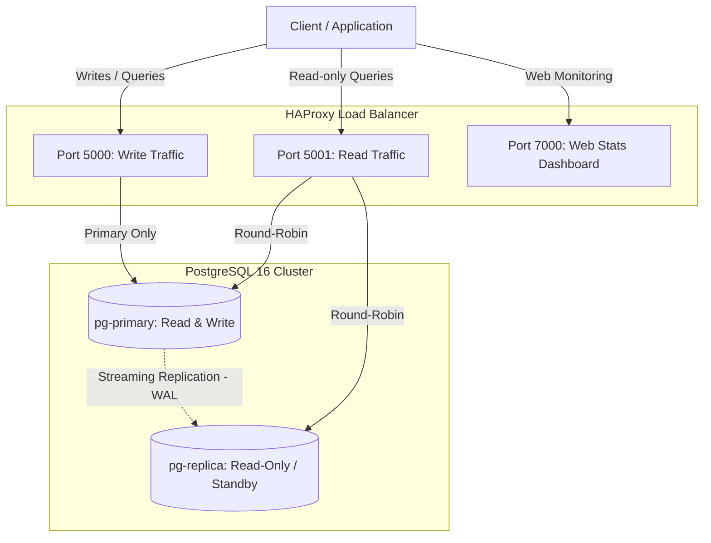

# PostgreSQL High-Availability (HA) Cluster

High-availability and read-scalable cluster for **PostgreSQL 16** with physical streaming replication (*Streaming Replication*) and load balancing via **HAProxy**, orchestrated with **Podman / Docker Compose**.

---

## 🏗️ System Architecture



### Key Components:
1. **`pg-primary`**:
   - Primary node (Read/Write).
   - Automatically provisions the replication user (`REPLICA_USER`) and authorizes the network in `pg_hba.conf` via the initialization script [`postgres/primary/01-init-replication.sh`](postgres/primary/01-init-replication.sh).
2. **`pg-replica`**:
   - Secondary node (Read-Only / Hot Standby).
   - On its first boot, the [`postgres/replica/entrypoint.sh`](postgres/replica/entrypoint.sh) script waits for the primary and automatically clones the database using `pg_basebackup -R`.
3. **`haproxy-lb`**:
   - TCP layer load balancer.
   - Separates write traffic (routed directly to the primary node) from read traffic (distributed between primary and replica via Round-Robin).
   - Provides a real-time web metrics dashboard.
4. **`scripts/maintenance.py`**:
   - Python script to monitor replication lag and generate logical backups (`pg_dump`) stored in the `backups/` directory.

---

## 🔌 Ports and Endpoints

| Port | Protocol | Destination / Purpose | Mode |
|---|---|---|---|
| **`5000`** | TCP | `pg-primary:5432` | **Read & Write** (Direct to primary node) |
| **`5001`** | TCP | `pg-primary:5432` and `pg-replica:5432` | **Read-Only** (Round-Robin load balancing) |
| **`7000`** | HTTP | HAProxy Stats Dashboard | **Web Dashboard** (`http://localhost:7000`) |

---

## 📁 Project Structure

```text
.
├── docker-compose.yml              # Service definitions (primary, replica, haproxy)
├── .env.example                    # Environment variables template
├── .gitignore                      # Git ignore rules (backups, .env, caches)
├── README.md                       # Project documentation
├── haproxy/
│   ├── Dockerfile                  # Base image based on haproxy:alpine
│   └── haproxy.cfg                 # Load balancing and metrics configuration
├── postgres/
│   ├── primary/
│   │   └── 01-init-replication.sh  # Roles and permissions initialization script
│   └── replica/
│       └── entrypoint.sh           # Automatic bootstrapping script (pg_basebackup)
└── scripts/
    ├── maintenance.py              # Replication monitor and backup generator
    └── requirements.txt            # Python dependencies (psycopg2-binary)
```

---

## 🚀 Quick Start

### 1. Prerequisites
- [Podman](https://podman.io/) and `podman-compose` (or Docker and Docker Compose).
- Python 3.8+ (optional, to run maintenance scripts).

### 2. Configure Environment Variables
Copy the `.env.example` template to a new `.env` file:

```bash
cp .env.example .env
```

You can customize passwords and usernames in `.env` if desired:
```dotenv
POSTGRES_DB=app_db
POSTGRES_USER=postgres
POSTGRES_PASSWORD=supersecretpassword
REPLICA_USER=replicator
REPLICA_PASSWORD=replicatorpassword
```

### 3. Start the Cluster

Using **Podman**:
```bash
podman compose up -d
```

*(Or if using **Docker**)*:
```bash
docker compose up -d
```

Verify that all containers are running and healthy:
```bash
podman ps
```

---

## 🧪 Verification and Testing

### 1. HAProxy Control Panel
Open in your web browser:
👉 **[http://localhost:7000](http://localhost:7000)**

You will be able to monitor the health status of `pg_primary` and `pg_replica` in green.

### 2. Test Insertion (Write on port 5000)
Connect to port 5000 to insert records into the database:

```bash
psql -h 127.0.0.1 -p 5000 -U postgres -d app_db -c "
CREATE TABLE IF NOT EXISTS test_ha (id SERIAL PRIMARY KEY, note TEXT, created_at TIMESTAMP DEFAULT NOW());
INSERT INTO test_ha (note) VALUES ('Replicated successfully');
"
```

### 3. Test Read and Load Balancing (Port 5001)
Query through the balanced port:

```bash
psql -h 127.0.0.1 -p 5001 -U postgres -d app_db -c "SELECT * FROM test_ha;"
```

Check which node responds to the read query:
```bash
psql -h 127.0.0.1 -p 5001 -U postgres -d app_db -c "SELECT inet_server_addr(), pg_is_in_recovery();"
```
* If `pg_is_in_recovery` returns `f` (false), the query was answered by the **primary**.
* If it returns `t` (true), it was answered by the **replica**.

---

## 🛠️ Maintenance and Backups

The project includes a maintenance utility in [`scripts/maintenance.py`](scripts/maintenance.py) to monitor replication lag and generate backups.

### 1. Install Dependencies
```bash
pip install -r scripts/requirements.txt
```

### 2. Run Maintenance Script
```bash
python scripts/maintenance.py
```

The script performs:
1. **Replication Check:** Queries `pg_stat_replication` showing the standby node's IP, streaming status, and replication lag in bytes.
2. **Backup Generation:** Executes a logical dump using `pg_dump` and stores it neatly in the dedicated folder:
   ```text
   backups/backup_app_db_YYYYMMDD_HHMMSS.sql
   ```
   *(This `backups/` directory is created automatically and is ignored in `.gitignore`).*

---

## 🛑 Stopping and Cleaning Up the Cluster

To stop the services and remove containers:
```bash
podman compose down
```

To perform a **complete reset from scratch** (also removing persistent data volumes):
```bash
podman compose down -v
```
